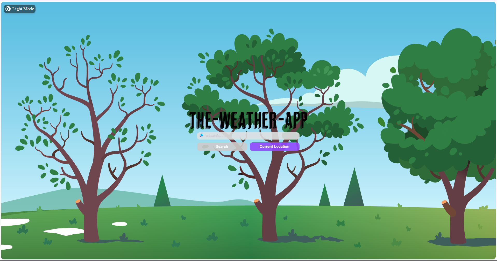
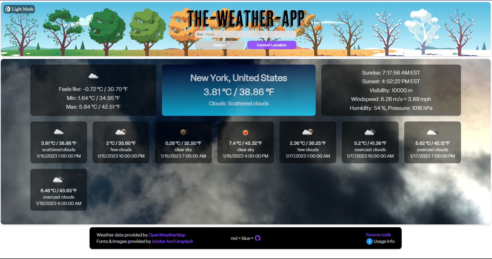

# The-Weather-App
### Get real-time weather updates in a visually pleasing interface, crafted with JavaScript, CSS, and utilizing OpenWeatherAPI.

<table>
  <td align="center"><b>Made using:</b></td>
  <td> 
    
    
    
    
  </td>
</table>

###### Additional libraries used: css-loader, gh-pages [For deployment], html-webpack-plugin [To generate output html], babel [compatibility], topbar [Loading bar], crypto-js [Basic encryption]

## **Click on the pictures/the link below to try!**

## [Click to open](https://redplusblue.github.io/weather-app/)

## Features:
1. Provides real-time weather information including but not limited to temperature, humidity, wind speed, sunrise, sunset, visibility alongwith a forecast for the next 3-4 days. 
2. Can check the weather for [any*](http://bulk.openweathermap.org/sample/) city by searching its name.
3. Can also fetch the weather for your precise current location.

## What I used/learned:
1. JS: callbacks, promises, Asynchronous functions, async/await, fetch, .then()
2. CSS: Multiple animations

 

### What I did well (I think): 
1. Code is clean and modularized.
2. Webpage is aligned and styled proportionately.
3. Number of API calls (To the weather service) Are minimized.

### What I could've done better (Working on it...):
1. The size of the app ~ 1 MB, not the best for cross platform and cross network stability, but I anticipate that it wont ruin the experience for the average viewer.
2. Compatibility for mobile phones

 

###### An exercise for [TheOdinProject](theodinproject.com)
